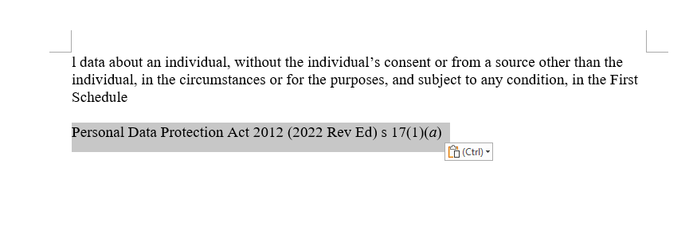

# About
 Web extension to auto generate citation when copying from legal sources.

 Currently supported websites are:
 1. https://sso.agc.gov.sg/Act/**

# Preview
## Copy


## Paste



# To develop and run
```
npm i
npm run build
```

To run the web extension in the firefox / chrome browser
```
npm run start:firefox
npm run start:chrome
```

## To test
```
npm run test
```

